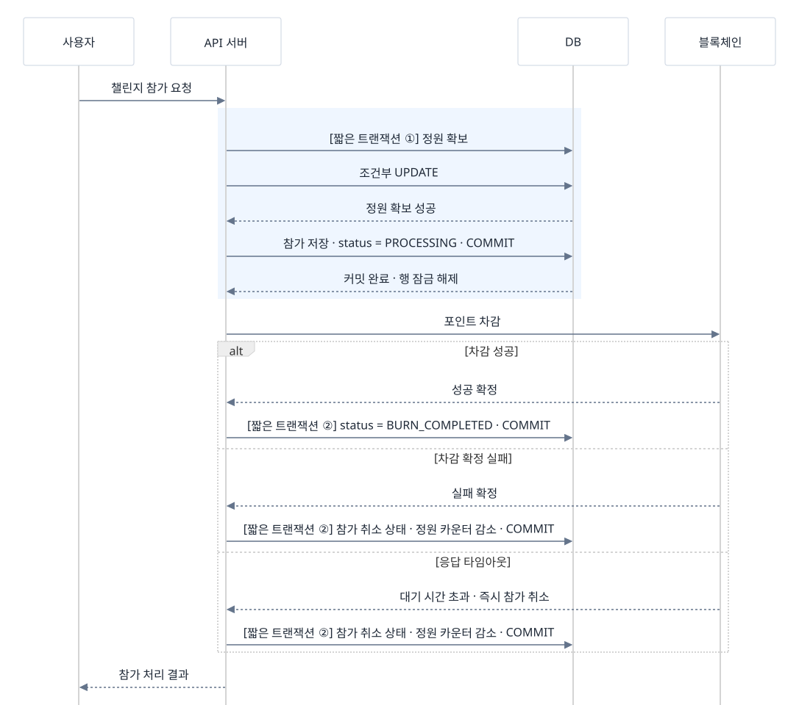

# 안철현

**Backend Engineer**

Java·Spring 기반의 백엔드 시스템을 설계·개발하고 운영해 왔습니다.<br>
운영 환경에서 발생하는 외부 시스템 응답 지연, 동시성 문제, 스레드·DB 자원 고갈을 분석하고 처리 구조와 트랜잭션 범위를 개선해 왔습니다.

- **요청 처리 구조 고도화** — 블록체인이 수용 가능한 처리량을 고려해 배치 크기와 동시 실행 한도를 조정하고, I/O 대기 중 플랫폼 스레드 점유 비용을 줄이기 위해 Virtual Thread 기반 실행 구조로 전환
- **운영 안정화** — 트래픽·응답 지연·에러·리소스 사용량을 모니터링해 병목과 장애 원인을 분석하고, 실행 구조와 자원 사용 방식을 개선
- **트랜잭션 최적화·정합성 설계** — 외부 I/O 대기를 DB 트랜잭션에서 분리해 자원 점유 시간을 줄이고, 상태 관리와 동시성 제어로 단계 간 데이터 정합성을 유지

---

## 목차

1. 블록체인 Write 트랜잭션 미들웨어 처리 구조의 고도화 과정
   - 1-1. 블록체인 Write 트랜잭션 비동기 배치 처리 설계
   - 1-2. 블록체인 배치 응답의 무기한 대기로 인한 공유 비동기 스레드 풀 고갈 개선
   - 1-3. Virtual Thread·Semaphore 기반 보상 실행 구조 개선

2. 외부 쇼핑몰 결제 연동의 블록체인 포인트 정합성 보장
3. 선착순 이벤트 참가 트랜잭션 장기 점유 개선

---

## 1. 블록체인 Write 트랜잭션 미들웨어 처리 구조의 고도화 과정

블록체인 Write 요청의 비동기 배치 설계에서 출발해, 운영 장애를 계기로 공유 비동기 풀의 무기한 대기 문제를 개선하고 실행 구조를 버추얼 스레드 기반으로 전환했다. 동일한 Write 트랜잭션 미들웨어를 단계적으로 고도화한 과정이다.


### 1-1. 블록체인 Write 트랜잭션 비동기 배치 처리 설계

**기술 스택** Java 17 · Spring Boot 2 · MySQL · Hyperledger Besu

#### 배치 처리가 필요한 이유

보상 요청마다 별도의 블록체인 트랜잭션을 전송하면, 요청 수만큼 트랜잭션 생성·서명·전송과 receipt 확인이 반복된다. 특히 한 요청의 결과를 받은 뒤 다음 요청을 보내는 순차 처리에서는 블록 포함과 응답을 기다리는 시간이 누적된다. 여러 보상 요청을 하나의 트랜잭션으로 묶어, 이 반복 비용을 줄이고 한 번의 응답 대기로 여러 요청의 결과를 받도록 배치 처리를 도입했다.

**예시: 쓰기 요청 10건을 개별 전송하는 경우와 하나의 배치로 전송하는 경우**

| 비교 항목 | 개별 트랜잭션 10개 | 보상 요청 10건을 담은 배치 트랜잭션 1개 |
|---|---|---|
| 처리할 보상 요청 | 10건 | 10건 |
| 트랜잭션 생성·서명·전송 | 10회 | 1회 |
| 확인할 트랜잭션 receipt | 10개 | 1개 · 내부 요청별 결과 매핑 필요 |
| 순차 요청·응답 대기 | 10회 | 1회 |
| 가스 비용 구조 | 각 트랜잭션의 기본 비용과 보상 처리 비용 반복 | 배치 트랜잭션의 기본 비용은 한 번, 처리 비용은 배치에 포함된 요청만큼 발생  |
| 최상위 트랜잭션 실패 시 영향 | 해당 트랜잭션의 보상 요청 1건 | 배치에 포함된 보상 요청 10건의 온체인 변경 전체 롤백 |

배치의 효율은 **업무 처리 10건을 없애는 것이 아니라, 트랜잭션 단위의 반복 비용과 순차 응답 대기 횟수를 줄이는 데 있다.** 실제 가스 절감량은 컨트랙트 구현과 저장 상태에 따라 달라진다. 또한 배치가 커질수록 가스 한도 초과와 전체 롤백의 영향이 커지므로, 당시에는 배치당 최대 20건으로 제한했다.

#### 처리 구조

여러 유형의 블록체인 Write 요청을 개별 전송하지 않고 하나의 배치 트랜잭션으로 처리했다. 요청 유형별 인메모리 큐에 데이터를 적재하고, RxJava 단일 Scheduler가 처리 시점에 큐에서 최대 20건을 꺼내 순차 전송했다. 결과가 필요한 호출부에는 요청별 CompletableFuture로 처리 결과를 전달했다.



> *20건이 모일 때까지 기다리지 않고, 처리 신호를 받은 시점에 큐에 들어 있던 요청을 최대 20건까지 묶었다.*

| 구성 | 역할 |
|---|---|
| 요청 유형별 ConcurrentLinkedQueue | 여러 유형의 Write 요청을 분리해 수집 |
| PublishSubject | 배치 처리 신호 전달 |
| 단일 Scheduler | 큐에서 최대 20건을 구성하고 블록체인 요청을 순차 전송 |
| 요청 식별자 | 배치 응답을 원래 요청과 연결 |
| CompletableFuture·DB 반영 | 호출부에 결과를 전달하거나 상태·이력을 갱신 |

#### 적용 결과

- 최대 20건의 Write 요청 트랜잭션을 단일 배치 트랜잭션으로 처리했다.
- 요청 수집과 블록체인 처리를 분리하고, 인스턴스 내 전송 순서를 제어했다.
- 블록체인 응답을 요청별 Future와 상태 반영 경로에 연결했다.

초기 구조는 배치 처리량과 전송 순서를 제어했지만, 보상 호출부는 Future의 수동 완료와 시간 제한 없는 `join()`에 의존했다. 운영 중 배치 생성 예외로 Future 완료가 누락되면서, 결과를 기다리는 작업이 공유 비동기 풀의 플랫폼 스레드를 모두 점유하면서, 같은 풀을 사용하는 일반 비동기 작업까지 실행되지 않는 장애로 이어졌다.

### 1-2. 블록체인 배치 응답의 무기한 대기로 인한 공유 비동기 스레드 풀 고갈 개선

**기술 스택** Java 17 · Spring Boot 2

#### 문제 발견

당시 블록체인 배치 결과를 기다리는 보상 작업과 일반 비동기 작업은 하나의 플랫폼 스레드 풀을 공유했다. 운영 중 보상 작업이 공유 풀의 스레드를 모두 점유해 일반 비동기 작업도 실행되지 못했다. 장애 당시 스레드 덤프에서 `CompletableFuture.join()`의 `WAITING (parking)` 상태를 다수 확인했다.

#### 장애 전파 경로



#### ① 무한 대기 해소

| 문제 | 적용한 변경 |
|---|---|
| 배치 생성 예외 시 미완료 Future 잔존 | 예외 경로에서도 대기 요청을 실패 결과로 완료 |
| `join()` 무기한 대기 | `get(60, TimeUnit.SECONDS)`로 호출부 최대 대기 시간 제한 |
| RPC 연결 오류 | HTTP 클라이언트 공유, 유휴 연결 유지 시간 조정, 연결·읽기·쓰기 타임아웃 설정 |
| 배치 구독 오류 | 제한된 재구독 적용 |

#### ② 지연·요청 집중에 대한 자원 격리

**보상 대기가 일반 비동기 작업에 영향을 주지 않도록 비동기 스레드 풀을 분리하고, 플랫폼 스레드 수를 제한했다.**

**보상 요청 1,000건 유입 시**

```text
최대 20건 실행 + 나머지 980건은 Runnable 큐에서 대기
 → 실행된 작업이 블록체인 배치 큐에 데이터 등록
 → 배치 소비자가 최대 20건을 묶어 전송
 → 결과 반영·작업 종료 후 다음 대기 작업 실행
```

*동시 실행 한도 20개는 진행 중인 보상 작업 수, 배치 한도 20건은 트랜잭션 하나에 담는 요청 수다.*



#### 핵심 구현

| 변경 항목 | Before | After |
|---|---|---|
| 예외 시 결과 전달 | 일부 예외 경로에서 Future 완료 누락 | 예외 경로에서도 미완료 Future를 실패 결과로 완료 |
| 결과 대기 시간 | `join()`으로 무기한 대기 | `get(60, TimeUnit.SECONDS)`로 최대 60초 제한 |
| 비동기 스레드 풀 | 일반 작업과 보상 작업이 풀 공유 | 보상 전용 비동기 스레드 풀 분리 · 플랫폼 스레드 최대 20개 |
| 초과 보상 작업 | 공유 비동기 스레드 풀의 작업 큐에 대기 | 보상 전용 Runnable 큐에서 대기 · 일반 작업과 격리 |
| RPC 오류 대응 | 연결 오류가 서비스 전체의 문제로 전파 | HTTP 클라이언트 공유·타임아웃 설정 정비 · 제한된 재구독 적용 |

#### 적용 결과

- **처리량 유지:** 워커당 초당 최대 20건의 보상 요청을 안정적으로 처리했다.
- **장애 영향 격리:** 보상 전용 비동기 스레드 풀을 분리해, 보상 지연 중에도 일반 비동기 작업이 진행되도록 했다.
- **무기한 대기 해소:** 예외 경로에서도 Future를 완료하고, 결과 대기를 최대 60초로 제한했다.
- **스레드 사용 제한:** 최대 20개 작업만 실행하고 초과 요청은 Runnable 큐에서 대기하도록 했다.


> 60초 타임아웃은 온체인 실패나 취소를 의미하지 않는다. 대기 큐는 무제한 메모리 큐로, 적체 시 메모리 사용량이 증가하고 종료 시 대기 작업이 유실될 수 있다. 큐 한도 초과 시 거절된 요청을 처리하는 경로가 없어 무제한 큐를 유지했다.

이 단계에서 실행량 제한·큐 대기·작업 격리를 적용했다. 다음 단계에서는 이 제어를 유지하면서 비동기 스레드 풀을 작업별 버추얼 스레드 방식으로 전환했다.

### 1-3. Virtual Thread·Semaphore 기반 실행 구조 개선

**기술 스택** Java 21 · Spring Boot 3

#### 전환 배경

1-1에서는 보상 요청을 배치로 묶어 블록체인에 순차 전송했고, 1-2에서는 보상 전용 플랫폼 스레드 풀을 분리해 최대 20개 작업만 실행하고 초과 요청은 Runnable 큐에서 대기하도록 했다. 다만 실행 중인 작업은 결과를 기다리는 동안에도 플랫폼 스레드를 점유해, 동시 실행량을 늘리면 스레드 생성·유지 비용도 함께 증가했다.

Java 21 전환을 계기로 작업마다 Virtual Thread를 생성해 외부 응답 대기 중 플랫폼 스레드 점유 부담을 줄였다. 별도 Runnable 대기 큐를 제거하고, DB 준비 종료 후 Semaphore로 블록체인 요청 발행·결과 대기와 성공 이력 저장 구간을 최대 100개로 제한했다. 배치 소비자가 블록체인 요청을 순차 전송하는 구조는 유지했다.

#### 처리 구조 비교

| 구성 | 플랫폼 스레드 풀 + Runnable 큐 | Virtual Thread + Semaphore |
|---|---|---|
| 작업 실행 | 풀의 플랫폼 스레드에서 실행 | 작업마다 Virtual Thread 생성 |
| 초과 요청 | 실행 전 Runnable 큐에서 대기 | DB 준비 종료 후 Semaphore 허가 대기 |
| 동시 실행 제한 구간 | DB 준비부터 업무 상태 반영까지 | 블록체인 요청부터 지급 내역 저장까지 |
| 동시 실행 한도 | 보상 작업 최대 20개 | 인스턴스당 최대 100개 진입 |
| 블록체인 배치 | 최대 20건 · 순차 전송 | 최대 40건 · 순차 전송 |

#### 현재 처리 흐름



#### 배치 크기와 동시 요청 한도 설정 근거

| 설정 | 선택 근거 |
|---|---|
| 배치 크기 **20건 → 40건** | Virtual Thread 전환과 별개로, 트랜잭션의 Gas Limit과 실제 Gas Used를 확인해 한 번에 묶는 보상 요청 수를 확대했다. |
| Semaphore 허가 **100개** | 동시 발행 요청이 많으면 배치 순서 대기가 결과 대기 제한인 60초를 초과할 수 있었다. 타임아웃 발생을 줄이기 위해 초과 요청은 배치 큐에 적재하기 전에 대기하도록 제한했다. |

> 배치 크기는 트랜잭션 하나에 담는 요청 수이고, Semaphore 허가 수는 요청 발행·결과 대기와 성공 이력 저장 구간에 진입할 작업 수다. 허가 대기는 Future의 60초 제한에 포함되지 않는다.

#### 개선 효과

| 개선 항목 | 효과 |
|---|---|
| 플랫폼 스레드 생성·점유 부담 감소 | 외부 응답 대기를 Virtual Thread로 전환해, 동시 작업 증가에 따른 플랫폼 스레드 생성·점유 부담을 줄였다. |
| 실행 구조 단순화 | 별도 Runnable 대기 큐 관리 대신 Semaphore 허가 획득·반환으로 제어했다. |

#### 남은 과제

| 현재 한계 | 보완 방향 |
|---|---|
| 허가 대기 작업과 DB 준비 작업의 동시성에 별도 상한 없음 | 대기 작업 수·메모리·DB 부하 관측 후 유입량 제어 검토 |
| 대기 작업 영속화 없음 | DB 작업 테이블 또는 영속 메시지 큐로 미완료 작업 복구 |

---

## 2. 외부 쇼핑몰 결제 연동의 블록체인 포인트 정합성 보장

**담당 범위** 
외부 쇼핑몰 결제·블록체인 포인트 연동 설계 및 구현

외부 쇼핑몰에서 자사 서비스 포인트를 결제에 사용할 수 있도록 연동했다. 결제에 포인트가 사용된 경우, 쇼핑몰의 결제 확정 요청을 받아 사용한 만큼 블록체인 포인트를 차감하도록 구현했다. 이를 위해 사용자 서명을 보관하고, 중복 결제 확정 요청과 동시 환불 요청을 처리했다.

### 결제 처리 흐름




### 핵심 설계와 선택 이유

| 과제 | 적용한 설계 | 선택 이유 |
|---|---|---|
| 서명 생성과 결제 확정 시점 분리 | 사용자 서명·주문 정보를 Redis Hash에 TTL로 보관 | Webhook 수신 시 사용자 앱의 재참여 없이 차감하고, 만료 데이터는 자동 정리 |
| 중복 주문 생성 방지 | 주문 ID 기준 기존 레코드 확인·DB UNIQUE 제약, 블록체인 요청 식별자 연결 | 동일 주문의 결제 레코드 중복 저장 방지 |
| 완료된 결제의 재요청 처리 | PAID 상태 확인 후 기존 결과 반환 | 완료된 주문의 차감 재실행 방지 |
| 동시 환불 요청 제어 | 주문 ID 기준 Redisson Lock, 잠금 획득 후 최신 상태·잔여 환불 가능 금액 검증 | 동일 주문의 환불 검증·처리 구간 직렬화 |
| 부분·전액 환불 추적 | 블록체인 요청 식별자·금액·유형·사유를 환불 이력에 저장 | 누적 환불 금액 검증과 처리 내역 추적 |

### 환불 처리 흐름



### 적용 결과

- 사용자 서명 생성과 쇼핑몰 결제 확정을 분리하고, Webhook에서 서버가 후속 차감을 수행하도록 구성했다.
- 주문 중복 저장과 완료된 결제의 차감 재실행을 방지하는 처리를 적용했다.
- 부분·전액 환불의 이력을 남기고, 누적 금액을 기준으로 환불 가능 금액을 검증했다.

---

## 3. 선착순 이벤트 참가 트랜잭션 장기 점유 개선

**역할·범위** 
설계 · 개발 · 운영 배포

운영 모니터링에서 긴 DB 자원 점유를 발견하고, **조건부 UPDATE와 짧은 트랜잭션·상태 관리**를 적용했다.

### 문제 발견

| 관찰 | 코드에서 확인한 원인 |
|---|---|
| Elastic APM에서 요청별 커넥션 점유 확인 | 참가 메서드 전체에 `@Transactional` 적용 |
| 커넥션 획득부터 반환까지의 시간 측정 | 챌린지 행 잠금 이후 블록체인 잔액 조회·차감 수행 |

요청별로 DB 커넥션을 획득한 뒤 반환할 때까지의 점유 시간을 측정해 APM에 기록했다. 이 지표와 코드의 트랜잭션 범위를 함께 살펴, 블록체인 응답을 기다리는 동안에도 DB 자원을 점유하는 구간을 확인했다.

### 개선 전·후



**변경점:** 정원 확보 요청은 직렬화하고, 블록체인 응답 대기는 DB 쓰기 트랜잭션에서 분리했다.

### 처리 방식 후보

**선택 이유:** 정원 확인과 증가를 한 SQL로 처리하기 위해 **조건부 UPDATE**를 선택했다. 블록체인 호출은 트랜잭션 밖으로 분리해 **DB 점유 구간을 줄였다.**

| 방식 | 장점 | 적합한 상황 |
|---|---|---|
| SELECT FOR UPDATE · 전체 처리 구간 | 검증·변경을 한 트랜잭션에서 직렬화 | 처리 구간이 짧고 DB 작업이 중심일 때 |
| SELECT FOR UPDATE + 상태 관리 · 짧은 트랜잭션 | 기존 잠금 로직을 활용하며 외부 호출 분리 | 기존 코드 변경을 줄이면서 트랜잭션 점유를 줄일 때 |
| **조건부 UPDATE + 상태 관리 · 선택** | **정원 확인·증가를 한 SQL로 처리** | **DB 한 행의 조건으로 정원을 제어하고, 분리된 결과를 상태로 관리할 때** |
| 낙관적 락 + 재시도 | 버전 검증으로 동시 변경 충돌 감지 | 동일 데이터의 동시 수정이 드물고 충돌 시 재시도가 가능할 때 |
| Redis 분산 락 | 여러 서버의 공유 작업을 하나의 키로 제어 | DB 행 하나로 제어하기 어려운 작업을 직렬화할 때 |
| Redis 원자적 카운터 | Redis에서 정원 확인·증가를 원자적으로 처리 | 대량 슬롯 예약을 처리하고 DB 동기화·복구 체계를 갖출 수 있을 때 |
| 메시지 큐 + 순차 처리 워커 | 요청을 버퍼링하고 처리 속도 조절 | 즉시 확정 대신 접수 응답이 가능하고 요청 급증을 흡수해야 할 때 |

> *SELECT FOR UPDATE와 조건부 UPDATE 모두 배타 잠금을 사용하며, 점유 시간 단축의 핵심은 외부 호출을 트랜잭션 밖으로 분리한 것이다.*

### 최종 처리 흐름



**현재 한계:** 타임아웃 시 참가를 취소하고 정원을 반환한다. 이후 차감이 늦게 성공하는 경우의 별도 처리는 없어, 참가 취소와 포인트 차감 결과가 불일치할 가능성이 남아 있다.

| 구성 | 담당 역할 |
|---|---|
| 조건부 UPDATE | 동일 챌린지의 정원 확보 직렬화 |
| 짧은 DB 트랜잭션 | 외부 응답 대기와 DB 잠금 점유 구간 분리 |
| 상태 관리 | 분리된 처리의 진행 상황·결과 관리 |

### 적용 결과

- **운영 배포 완료:** 조건부 UPDATE와 트랜잭션 범위 분리 적용
- **상태 관리 도입:** 차감 성공 시 완료 상태 반영, 확정 실패·타임아웃 시 참가 취소 및 정원 반환

| 지표 | Before | After | 감소율 |
|---|---:|---:|---:|
| 최대 커넥션 점유 시간 | 804.303 ms | 119.138 ms | 85.2% |
| 총 커넥션 점유 시간 | 833.070 ms | 153.919 ms | 81.5% |
